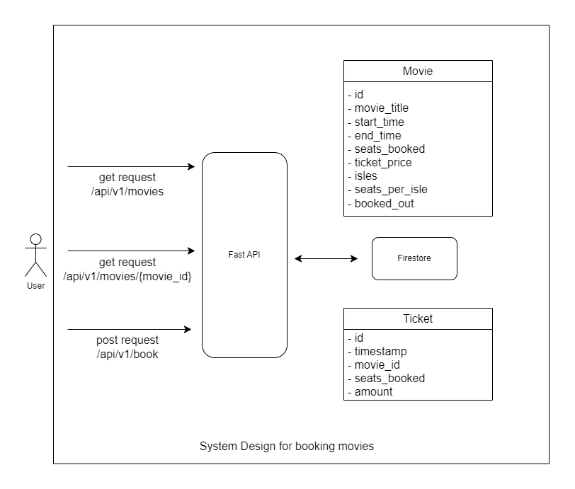
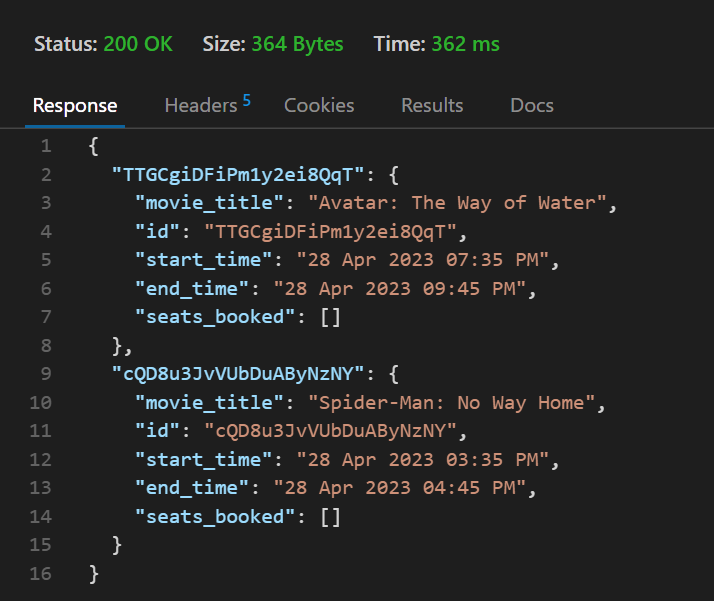
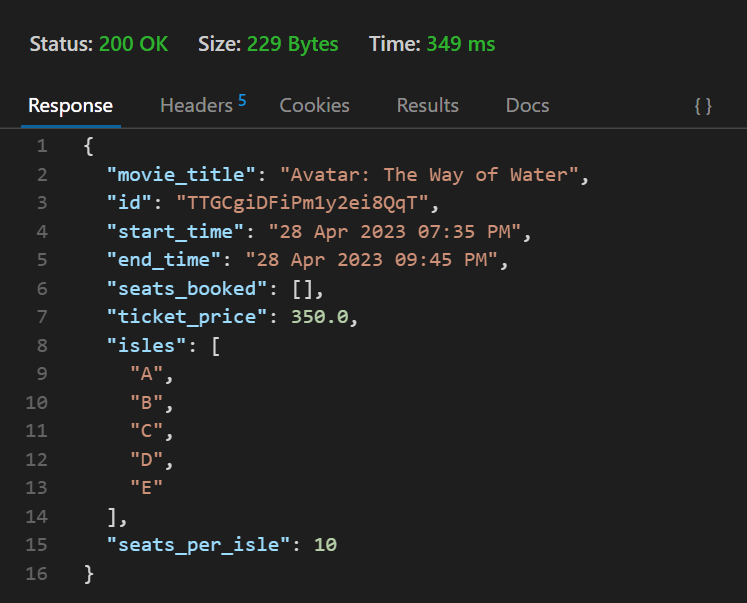
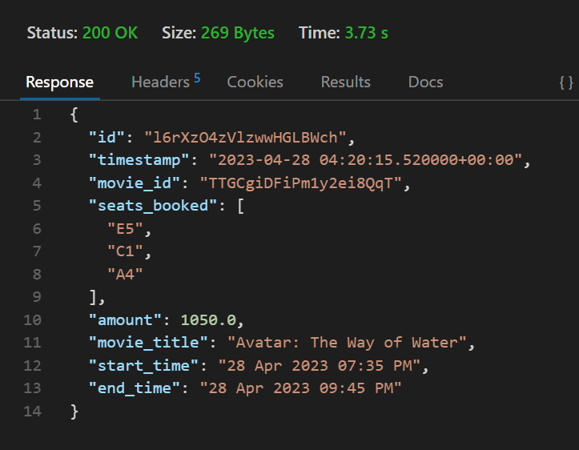
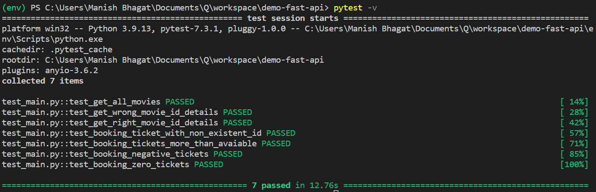

# FastAPI's for Movie Booking Portal

> Note - If the images are not loading in the README file. Clone the repo and view it on your local machine for best experince.

## System Design

#### API's avaiable to users

1. Get request `/api/v1/movies`

    Returns all the movies currently avaiable in the Firestore database.

    - Sample Response
    

2. Get request `/api/v1/movies/{movie_id}`

    Returns details about a specific movie. Such as start time, end time, seats booked, price of the ticket etc.

    > Note - 
    Request requires a valid `movie_id`. Use `/api/v1/movies` api to obtain it.

    - Sample Response
    

3. Post request `/api/v1/book`
   
   Books a ticket and returns ticket details.

   > Note - This post request requires a json object in the following format `{movie_id : str, number_of_tickets : int}
   `

   -  Sample Response
    
---

#### Technologies Used
- FastAPI
- FireO (for ORM) and FireStore as the Database
- Pydantic for validating requests and responses
- Pytest for testing the apis
- Pylint to lint and optimize the code.

---

#### Modules
- **main.py**
  - Includes the FastAPI logic
- **models.py**
  - Defines Movie and Ticket ORM using FireO 
  - Defines Pydantic models for MovieListRequest, MovieRequest, TicketRequest and TicketResponse to validate request and reponse
- **test_main.py**
  - Uses Pytest to test all FastAPIs
- **requirements.txt**
  - Lists all python dependencies.
- **images**
  - Contains output images

---

#### Running

##### Prerequisite 
1. It is assumed that gcloud sdk is setup. User has logged in and setup a project.
2. If not 
   1. Install [gcloud sdk](https://cloud.google.com/sdk/docs/install) on your machine.
   2. Create a [Firebase](https://firebase.google.com/) project. Link your gcloud sdk to this Firebase project.
   3. Proceed to the next steps.

> Note - It is recommed to create a python virtual [environment](https://docs.python.org/3/library/venv.html)

> 

1. Clone this repo
2. `cd` into the repo directory
3. Execute the following to install all the dependencies. `pip install -r requirements.txt`
4. Run the FastAPI server by using `uvicorn main:app --reload`

> Note - Once the application is running. You can access FastAPI's automatic interactive documentation at `http://localhost:8000/docs`

---

#### Testing

This application includes several tests. To run these tests
execute `pytest`

> Note - using -v flag shows the tests being executed in the terminal

   -  Expected result on testing this application.
    